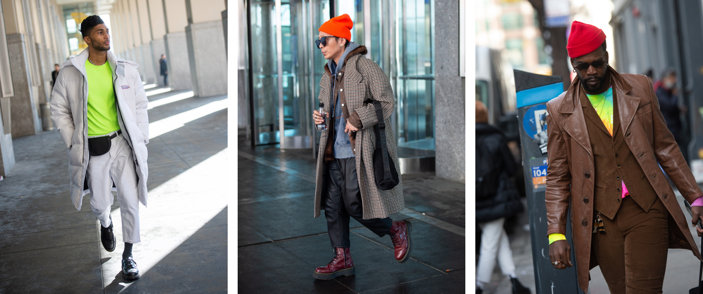
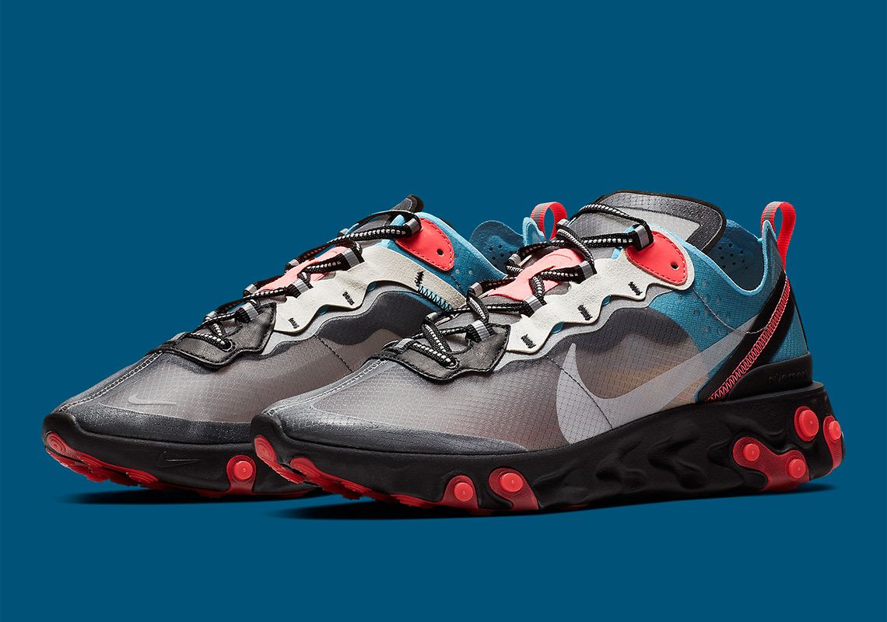

##### Welcome to the new site!

This summer we took a road trip through the Hudson valley up to Montreal, and had a really wonderful vacation. The Hudson valley is full of small farms and hippy cafes and rolling mountains. Montreal in the summer, with it's beautiful colors, vibrant community and incredible food really inspired and awoke the designer in me. This redesign is a collection of so many little and big things that made it's way into my consciousness during that trip.

Rolling into New York Fashion Week, I was noticing a trend of extremely bold colors and accents - from streetwear to the last round of big sneaker drops over the summer. To me this is a great thing! Check out some street looks from this season and the React Element 87 Solar Reds.

Combining all of this inspiration together, I was able to make a color palette. You can check out the color values and view the palette [at Kuler](https://color.adobe.com/Redesign-color-theme-13425637).

    

    

    

    

    

#### Designing
Moving onto my actual design, ultimately I landed on a mix of gradients and hard shapes that would pop some Nike-inspired Volt yellow every now and then. My angle was Nike React shoe - inside of Hipster art on wall cafe - on the way to Montreal in the summer... in a webpage.

I finally got a chance to use this brand new [Wacom Tablet](https://www.amazon.com/Wacom-Wireless-Software-Pistachio-CTL4100WLE0/dp/B079J7DCXN/) that I totally bought on a whim because I've always wanted one. The end result was the hero section on the homepage.

#### Developing
I settled on some technologies that I've been meaning to get into: [Gatsby](https://www.gatsbyjs.org/) & [Styled Components](styled-components.com/). It took a little bit of adjustment to get used to the workflow, but once I felt comfortable, coding felt really natural in this environment.

I deployed my site seamlessly and easily with [Netlify](https://www.netlify.com/).

#### Crowns

I got kind of into crowns after my son, Thierry, was born. His name means *Ruler of the people* in French. There's a play on words there because my name, Vincent, means *Conqueror* in Latin. I have a crown on a tattoo with his name and my wedding ring is also a crown.

#### Final Thoughts

I love the site I made. I was able to play with some things to help support my team as well as scratch my designer itch. I promise this time I'm going to write some more and now I have a home to do that. Don't be a stranger!